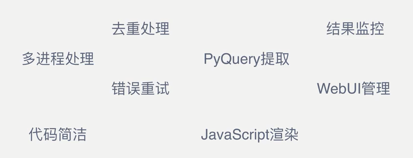

# PySpider框架笔记

## PySpider框架基本用法

### 功能简介

PySpider框架是非常简便、高效的爬虫框架。提供了WebUI界面，可以在其中编写爬虫、管理爬虫状态、查看当前调度任务



### 安装

网上找到这个whl文件

```powershell
pip3 install pycurl-7.43.0.2-cp37-cp37m-win_amd64
```

版本问题：

Python3.6 以下支持

Python3.7 需要手动替换async关键词，或者去GitHub下载


放弃学习！