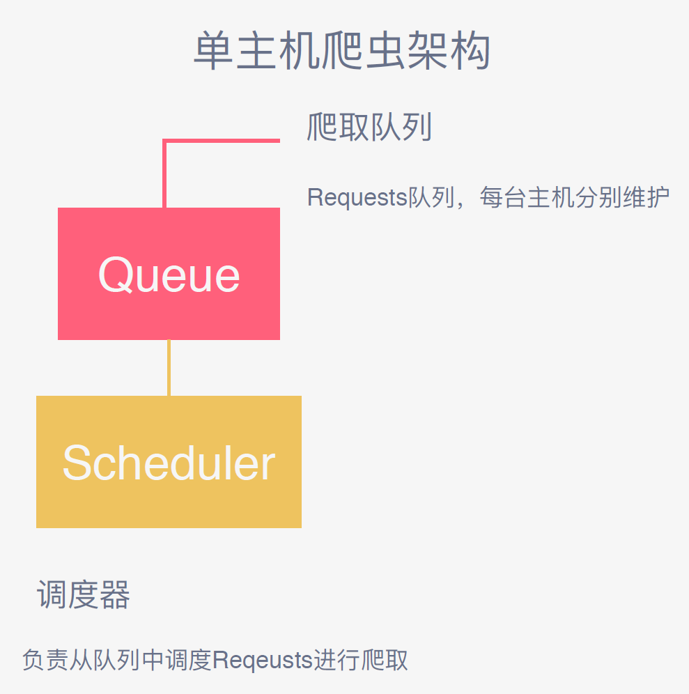
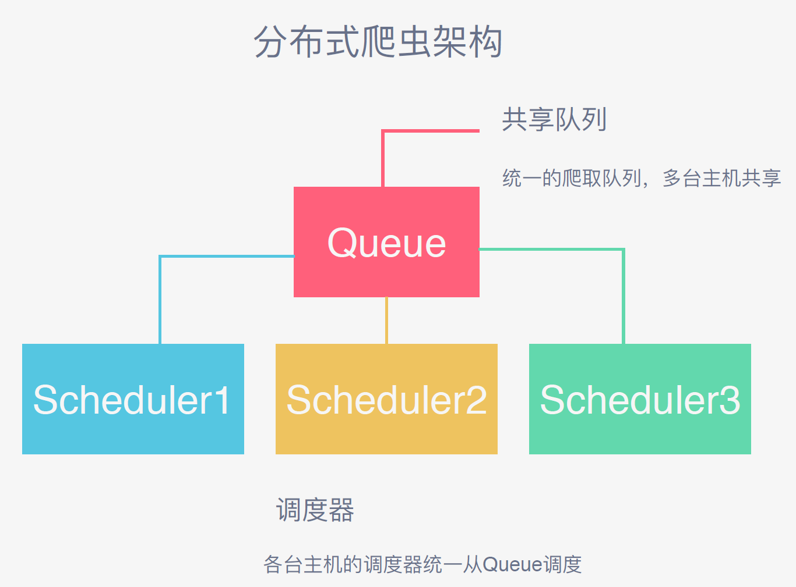
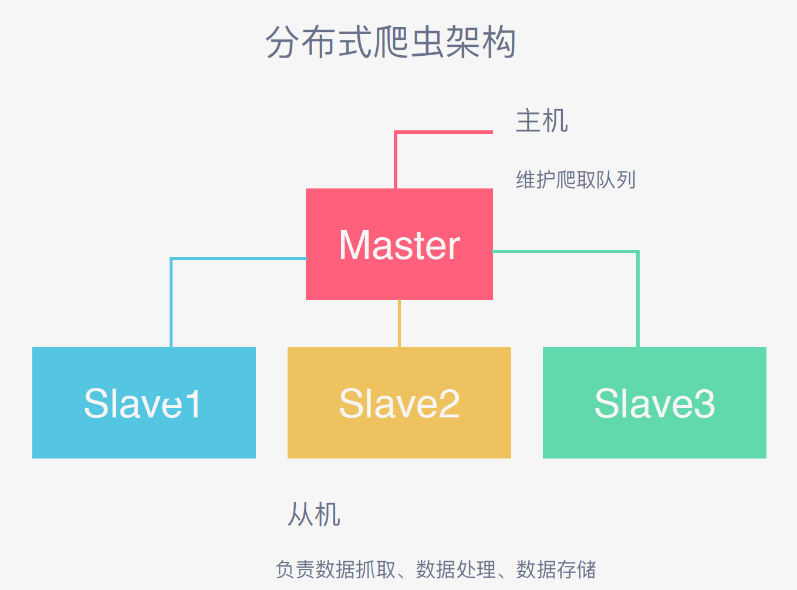

# Scrapy分布式

## Scrapy分布式原理

之前在Scrapy爬虫时，是在同一台机器上运行

### Scrapy单机架构

在本机维护一个 爬取队列，Scheduler进行调度

Scrapy Engine 调度 Request 队列，从中拿出 一个个的 Request 发给Downloader 执行请求，这个队列维护在本机，如果想要多台主机的协同爬取，各自的Request队列不能满足需求，必须要用 共享Request队列 才能协同合作，多台主机每一次在调度Request时候都是统一的访问这个共享队列。

多台主机协作的关键是 —— 共享爬取队列

Scrapy分布式的核心就是 把爬取队列做成多台主机共同访问的队列，由各台主机的Scheduler调度

### 分布式爬虫架构

Requests 队列由 Master 主机 选用 高效、可操作性的数据库或数据结构 来维护，从机维护调度器，负责……跟单机一样，只不过Request从Master获取

### 队列用什么维护

#### Redis队列

+ Redis，菲关系型数据库，Key-Value形式存储，结构灵活
+ 内存中的数据结构 存储系统，处理速度快，性能好
+ 提供队列、集合等多种存储结构，方便队列维护

### 怎样来去重？

多台主机，不仅要存还要取，可能有些主机可能请求同一个Request，怎么保证队列中 不重复

#### Redis集合

+ Redis提供集合数据结构，在Redis集合中存储每个Request的指纹（算法）
+ 在向Request队列中加入Request前首先验证这个Request的指纹是否已经加入集合中
+ 如果存在则不添加，不存在则添加到队列并将指纹加入集合

### 怎么样防止中断？

某些主机在爬取过程中可能出现故障，导致中断

#### 启动判断

> 这里不理解……

+ 在每台从机Scrapy启动时 都会首先判断当前 Redis Request队列是否为空
  + 如果不为空，则从队列中取得下一个Request执行爬取
  + 如果为空，则重新开始爬取，第1台从机执行 爬取 向队列中添加Request

### 怎样实现该架构？

Scrapy-Redis库，改写了Scrapy调度器，队列等组件

实现了

+ 爬取队列
+ 调度器
+ 去重
+ 连接Redis基本接口

方便实现Scrapy分布式架构，完美配合Scrapy完成分布式结构爬取